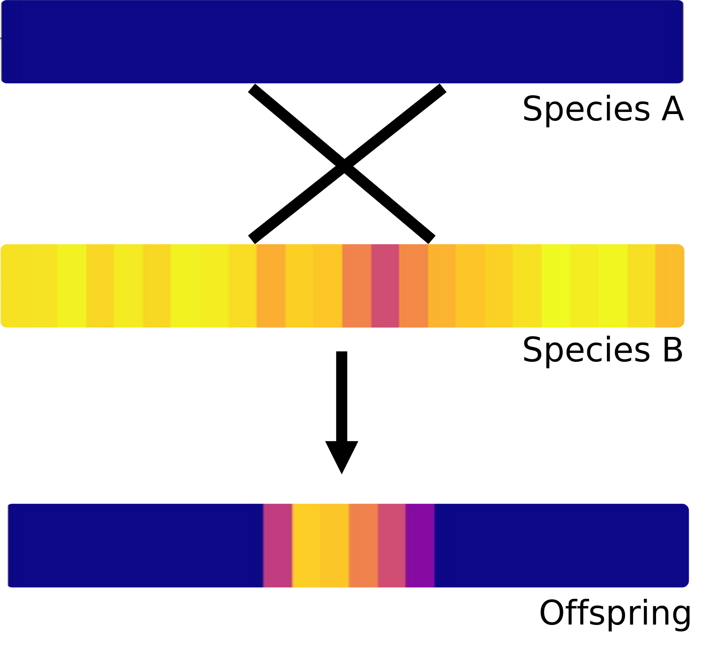
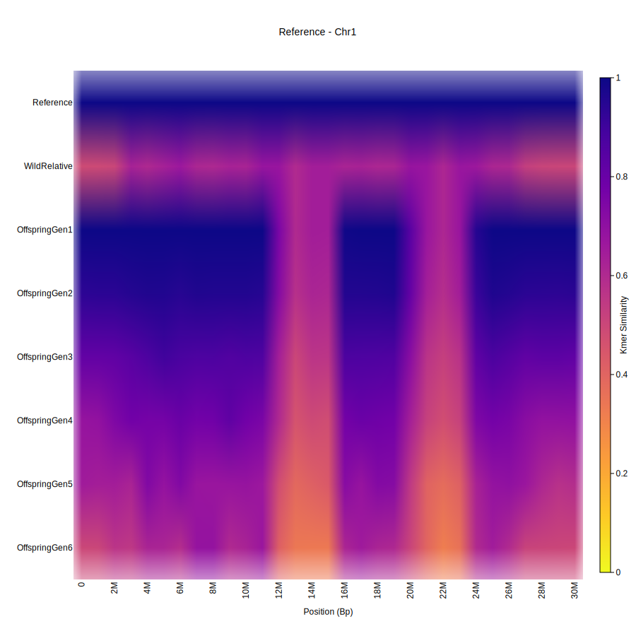
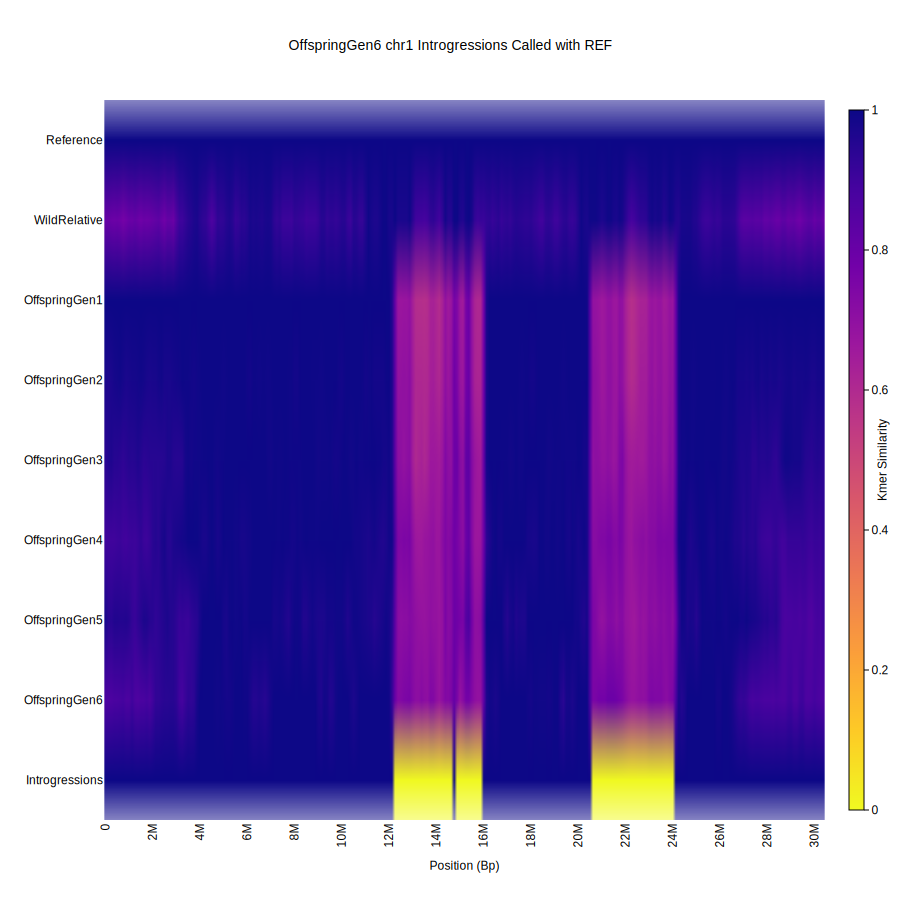
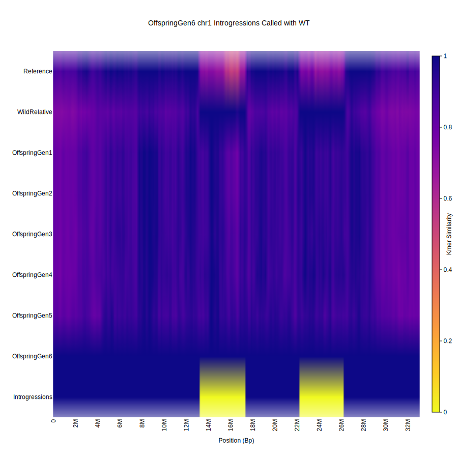

# Introgression Calling with Panagram

<div align="center">
  
</div>

Introgressions are regions where one species has inherited a sequence from another related species.
Panagram's bitmap enables calculating kmer similarity, the fraction of shared kmers between an
anchor and all other accessions in a pangenome. This allows one to call introgressions by
looking for differences between a reference anchor and another accession, or by looking for
similarities between one accession and another suspected introgression donor.

The introgression caller found here can be used to identify potential introgressed regions across
a pangenome and save them to a BED file for further analysis. The introgression caller works best on
a pangenome of accessions that are the same species with a closely related introgression donor and
reference anchor. Chromosome regions are divided into discrete bins and introgressions are called on
a per-bin basis.

There are additionally scripts to generate simulated pangenomes with various numbers of mutations
and introgressions.

## Usage and Anchoring Requirements

The introgression caller requires the following to be available on the command line:
- [screen](https://www.gnu.org/software/screen/) (if using --sweep flag)
- [minimap2 and paftools.js](https://github.com/lh3/minimap2?tab=readme-ov-file#install) (if using 'lift' action during postprocessing)

Panagram must be run as usual before the introgression caller can be used. Note that the
introgression caller was tested on plant genomes with k = 31 for the initial Panagram
assembly step. You may want to try running Panagram with a similar value of k.

Once you have assembled a pangenome with Panagram, you will need an additional config.yaml file and
group.tsv file to control the introgression caller parameters. See below for the format for these
files. The introgression caller can be used as follows:

```
python introgression_runner.py <config.yaml> <--sweep>
```

The caller will try to run in two different modes, based on the parameters you provide:

- 2-way Comparison Mode:
In order to use this mode, set cmp to [REF]. This mode only requires anchoring on one genome,
REF, if urf is also set to true. In this mode, the caller
looks at the kmer similarity of a suspected introgression recipient with respect to REF. It marks
any bin with kmer similarity below the specified threshold as introgressed. This mode can be used
if you do not know which genomes the potential introgression donors are, or if anchoring on multiple
genomes would be very computationally expensive.

- 3-way Comparison Mode:
In order to use this mode, set cmp to [GRP], where GRP is the name for a group of related potential
introgression donors in the group.tsv file. You must still define REF as well, and you
must run anchoring for all suspected introgression recipients when running Panagram. In this mode,
the caller anchors on the introgression recipient and compares its kmer similarity to REF and to
GRP. It marks a bin as introgressed if the similarity to GRP is greater than REF by the specified
threshold. cmp can be a list of multiple groups; the caller will independently loop through each
group for each recipent and mark introgressions that potentially came from each GRP. The same
regions may be marked for different groups.

Add the `--sweep` flag to try a range of kmer similarity thresholds. Note that this
kicks off a number of threads equal to `18 * num. threads chosen in config file`.

## Helper Visuals

Before running the introgression caller, you may want to look at the similarities/differences
in kmer similarities between your genomes. You can view this in the Panagram browser, or use
the following script to output plots of kmer similarity after fixed kmers have been removed (a
common preprocessing step during introgression calling that makes differences more appearent):

```
python create_heatmap.py \
--index-dir <index_dir> \
--anchor <anchor_name>

optional arguments:
  -h, --help            show this help message and exit
  --index-dir INDEX_DIR
                        Directory containing the panagram index
  --anchor ANCHOR       Genome name to anchor on for visualization
  --groups GROUPS       group.tsv file to determine row order; not required
  --bitmap-step BITMAP_STEP
                        Step size for bitmap query (default: 100)
  --bin-size BIN_SIZE   Size of bins for visualization (default: 1000000)
```

## Outputs
There are 4 folders that the introgression caller can output:

- *raw*: Contains BED files after the calling step. BED files are labeled as follows:
AccessionName_Chromosome_GRP.bed. GRP is the name of the introgression donor group used during
calling. For 3-way comparisons, BED files contain potential introgression locations in the
coordinate system of the acession listed in AcessionName. If you use 2-way, GRP will either be REF
or REFA. REF means that the urf flag was set to true, and introgression locations will be
saved in the coordinate system of your REF accession. If urf was false (or the accession was listed
in rmu), introgression locations will be saved in the coordinate system of AcessionName.

- *heatmaps*: If you turned vis on, this is where you can find visuals in SVG format of kmer similarity
after any modifications made during the calling step (but before postprocessing). Visuals are
labeled the same way as the BED files.

- *postprocessed*: If you chose to run postprocessing, your postprocessed BED files will be here in the
same naming scheme used for the raw folder.

- *scored*: If scoring, there will be a precision/recall metrics file here based on the number of
introgressions that match the other method you are comparing to. There are also additional heatmaps
visualizing per-bin TP, FP, TN, and FN regions for each accession.

## Example

You can generate and run an introgression analysis for a simulated example pangenome by running
`./run_example.sh`. The example takes around 5 minutes to run. It generates a pangenome with the
following genomes:
- Reference: Chromosome 1 from the reference genome of *Arabidopsis thaliana*
- WildRelative: A simulated relative of *A. thaliana*, created by mutating Reference with SNPs, insertions,
and deletions
- OffspringGen1: Simulated F1 offspring of Reference x WildRelative. It is identical to Reference,
except 2 introgressions from WildRelative.
- OffspringGen[2-6]: More simulated offspring. They have the same introgressions as OffspringGen1,
but they have random SNPs, insertions, and deletions applied to them in order to simulate more distant
generations of offspring (e.g., F2, F3, etc.)

Here is what their kmer similarities look like when anchored on Reference, after removing fixed kmers:

<div align="center">
  
</div>

Notice that the 2 introgressions appear at 12 Mb and 20 Mb and appear as bands of lower kmer similarity.
However, since OffspringGen6 is less similar to Reference, many other spots also have low kmer similarity.
We can fix this with preprocessing - by setting gnm to -1, this normalizes the genomes so that their
average similarities to Reference are all roughly the same. After applying the parameters from
`2way_example_config.yaml`, we can call introgressions for OffspringGen6 much more easily. The kmer
similarities after preprocessing look like this:

<div align="center">
  
</div>

Note the row at the bottom denoting which areas were called as introgressions in yellow. You can see
this heatmap in the `./example/introgressions/2way_calls/2way_calls_0.8/heatmaps` after running `./run_example.sh`.

We can also use the 3-way caller to help with OffspringGen6. When we anchor on OffspringGen6 and apply
preprocessing, the kmer similarities look like this:

<div align="center">
  
</div>

Note that instead of being in the coordinate system of the Reference, we are in the coordinate system
of OffspringGen6. The 3-way caller looks for spots where the kmer similarity to Reference is lower than
the kmer similarity to WildRelative to call introgressions.

The `2way_example_config.yaml` and `3way_example_config.yaml` provide good defaults for introgression
analysis in other pangenomes. Feel free to play with the parameters in these files and check their
impact by running `python introgression_runner.py ./example/2way_example_config.yaml`
or `python introgression_runner.py ./example/3way_example_config.yaml` and looking at the heatmaps
generated in the `./example/introgressions` folder.

## Group File

The group.tsv is a tab-separated file with 2 columns:
- *name*: the name given to each accession in the samples.tsv file for Panagram

- *group*: the group an accession is a part of. 'REF' denotes one accession as the reference.
REF should be a genome suspected of having few to no introgressions with the suspected introgression
donors. REF should also be closely related (preferably the same species) as the genomes that you
suspect to be introgression recipients. Other groups can have any name. Typically there are at least
2 other groups - one for introgression donors and one for introgression recipients. Introgression
donor groups should be listed in the cmp parameter. Introgression recipient groups should be listed
in the grp parameter. You can also use the anc parameter to check a custom list of recipients for
introgressions (you must still create a group.tsv though).

## Config File Parameters

There are 3 parts to the introgression caller: calling, postprocessing, and scoring. Calling will
use kmer similarities to generate predicted introgression BED files for each accession you choose,
for your chromosome(s) of
choice. Postprocessing helps smooth these BED files and remove potential false positives. Scoring
can only be used if comparing called introgressions to the SV-based approach
[here](https://github.com/malonge/CallIntrogressions) or to compare against introgressions generated
by the simulator. It will calculate precision, recall, and other metrics based on the number of
introgressions that match the results from another method.

Parameters are controlled by a YAML file. See `example_config.yaml` and the tips section below
for reasonable defaults. The parameters for each section are as follows:

### General Parameters

| Parameter   | Type   | Description                                                               |
|-------------|--------|---------------------------------------------------------------------------|
| output_dir  | string | path to output folder                                                     |
| index_dir   | string | path to folder where Panagram was run for pangenome                       |
| tsv         | string | path to group.tsv file                                                    |
| bin         | int    | determines size of bin when discretizing chromosome regions               |
| ref         | string | name of reference accession; should be the only accession in the REF group|
| threads     | int    | number of threads to use                                                  |

### Calling Parameters

| Parameter | Type                 | Description                                                                 |
|-----------|----------------------|-----------------------------------------------------------------------------|
| run       | boolean              | whether to run calling                                              |
| grp       | string               | groups of suspected introgression recipients                                |
| anc       | list[string]/null    | accessions to run introgression caller for (set grp to null to use this list)|
| chr       | list[string]/null    | chromosomes to check for introgressions (null = all)                         |
| cmp       | list[string]         | REF and/or groups of suspected introgression donors to compare against       |
| thr       | float                | bins below threshold are introgressions for 2-way; bins more similar to grp than REF by threshold are introgressions for 3-way |
| stp       | int                  | kmer step size when sampling from bitmap; this should match the step size used when running Panagram |
| gnm       | float/-1/null        | shift kmer sims to this mean; -1 auto-calc; null disables                     |
| trm       | int/null             | omit values outside this many stdevs from gnm calculations                      |
| sft       | string/null          | choose either 'mean' or 'median' smoothing filter; might help even out small differences in kmer sim between bins; null disables |
| ssz       | int/null             | number of bins in sft filter window                                           |
| urf       | boolean              | use reference coordinate system; cmp must be set to '[REF]' |
| rmf       | boolean              | remove fixed kmers shared by all accessions                                  |
| rmu       | list[string]/null    | remove kmers not in REF or ogrp for these noisy accessions; forces urf=false for these accessions |
| ogrp      | list[string]/null    | remove kmers not present in these groups (exclude REF)                       |
| edg       | boolean              | highlight edges and dampen center kmer similarities                           |
| isc       | boolean              | increase contrast by boosting kmer similarities                               |
| vis       | boolean              | visualize binned bitmap and detected introgressions                          |

### Postprocessing Parameters

| Parameter | Type             | Description                                                                                                                                                                      |
|----------|-------------------|----------------------------------------------------------------------------------------------------------------------------------------------------------------------------------|
| run      | boolean           | whether to run postprocessing                                                                                                                                                    |
| act      | list[string]/null | choose postprocessing steps: 'lift' (liftover to ref coordinate space), 'fgap' (fill gaps between introgressed bins), 'fcen' (fill larger gaps caused by centromere), 'rmbn' (remove small introgressions); null to skip and just copy bed files to postprocess folder as-is for scoring |
| min      | int/null          | if rmbn, remove introgressions smaller than this number of bins                                                                                                                            |
| gap      | int/null          | if fgap, fill gaps between introgressions up to this number of bins                                                                                                                |
| map      | str/null          | if lift and not paf, minimap parameters for aligning to ref; must include -c flag; null to use '-x asm20 -c'                                                                 |
| paf      | str/null          | if lift already run, path to existing alignment folder to skip alignment                                                                                                 |

### Scoring Parameters

| Parameter | Type             | Description                                                                                                                     |
|----------|-------------------|---------------------------------------------------------------------------------------------------------------------------------|
| run      | boolean           | whether to run scoring; should almost always be false unless testing                                                            |
| gdt      | str               | path to folder containing Jaccard similarity text files or ground truth introgressions in the same format                      |
| act      | list[string]/null | apply postprocessing to ground truth; null to skip                                                                              |
| min      | int/null          | see postprocessing                                                                                                              |
| gap      | int/null          | see postprocessing                                                                                                              |
| thr      | float             | all values above this threshold are considered introgressed in the ground truth                                                 |
| cmp      | list[string]      | groups to check introgressions against; REF and merged results are compared against the set of introgressions in any group in this list |
| vis      | boolean           | visualize true/false positives and negatives per bin                                                                            |

## Tips for Choosing Parameters

Most parameters can remain as their defaults as shown in config_example.yaml. The most important
parameters to tune are as follows:

- *bin and min*: Bin size determines the smallest possible introgression that will appear in your output
before postprocessing. In general, introgressions tend
to span large chunks of a chromosome, so bin size should be fairly large. In testing, we compared
our method to one that called introgressions in 1,000,000 bp bins. We often used bin sizes smaller
than this and set min introgression size such that bin size * min = ~1,000,000 bp. We found that
a bin size of 125,000 worked best overall with min set to 8. For 2 way calling, size
500,000 additionally worked well with min set to 2.

- *gap*: This is dependent on bin size, like min. In testing, setting this such that bin size * gap =
1,000,000 bp worked best.

- *thr*: Easiest to tune after running the 2-way comparison once with the defaults, then looking at your
pangenome's kmer similarities in the *heatmaps* folder. You can also look at kmer similarities before
calling using `create_heatmap.py`, although depending on your parameters, preprocessing can substantially
change kmer similarity. For 2-way calling, try to determine what the
kmer similarity value is for large regions that are noticibly different from the reference (like in
the example above). In testing, for 2-way calling, thresholds between 0.7-0.8 worked best. For
3-way calling, the threshold is a bit less important. Smaller thresholds, between 0-0.2 worked best.

- *gnm*: This can help if you have very different genomes together in the same pangenome. Try setting
this to -1 first. If you notice that visually, there are too many bins that are set
to 1 across the Pangenome, try setting to 0.9 or lower.

## Introgression Simulator Usage

The simulator takes a reference FASTA and applies mutations to generate a wild relative. It then
takes the reference and replaces sections of it with the aligning section of the wild relative to
simulate a F1 offspring with introgressions. Subsequent generations of offspring are created by
applying mutations to the F1 offspring, up to the mutation rate chosen in the parameters.

```
python simulate_introgressions.py \
--ref <reference fasta to use as a base> \
--out-folder <output folder>

optional arguments:
  -h, --help            show this help message and exit
  --ref REF             Reference FASTA (input)
  --out-folder OUT_FOLDER
                        Output folder
  --offspring OFFSPRING
                        Number of offspring to simulate from created wild relative
  --rounds ROUNDS       Number of rounds to apply mutations to offspring. Will output offspring for each round
  --num-introgressions NUM_INTROGRESSIONS
                        Number of introgressions per generation
  --introgression-size-min INTROGRESSION_SIZE_MIN
                        Min introgression size (bp)
  --introgression-size-max INTROGRESSION_SIZE_MAX
                        Max introgression size (bp)
  --rel-sub-rate REL_SUB_RATE
                        Wild relative per-base substitution rate
  --rel-ins-rate REL_INS_RATE
                        Wild relative per-base insertion rate
  --rel-del-rate REL_DEL_RATE
                        Wild relative per-base deletion rate
  --rel-ins-size-min REL_INS_SIZE_MIN
                        Wild relative insertion size min (bp)
  --rel-ins-size-max REL_INS_SIZE_MAX
                        Wild relative insertion size max (bp)
  --rel-del-size-min REL_DEL_SIZE_MIN
                        Wild relative deletion size min (bp)
  --rel-del-size-max REL_DEL_SIZE_MAX
                        Wild relative deletion size max (bp)
  --mut-sub-rate MUT_SUB_RATE
                        Offspring per-base substitution rate
  --mut-ins-rate MUT_INS_RATE
                        Offspring per-base insertion rate
  --mut-del-rate MUT_DEL_RATE
                        Offspring per-base deletion rate
  --mut-rate-start MUT_RATE_START
                        Starting mutation rate for offspring (will increase linearly to mut_rate over rounds)
  --mut-ins-size-min MUT_INS_SIZE_MIN
                        Offspring insertion size min (bp)
  --mut-ins-size-max MUT_INS_SIZE_MAX
                        Offspring insertion size max (bp)
  --mut-del-size-min MUT_DEL_SIZE_MIN
                        Offspring deletion size min (bp)
  --mut-del-size-max MUT_DEL_SIZE_MAX
                        Offspring deletion size max (bp)
  --seed SEED           Random seed for reproducibility
```
